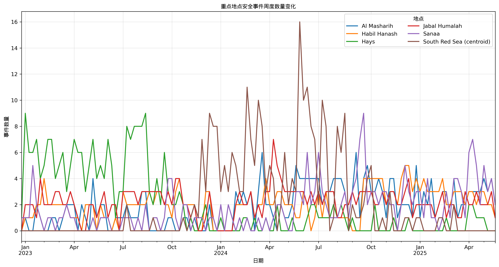
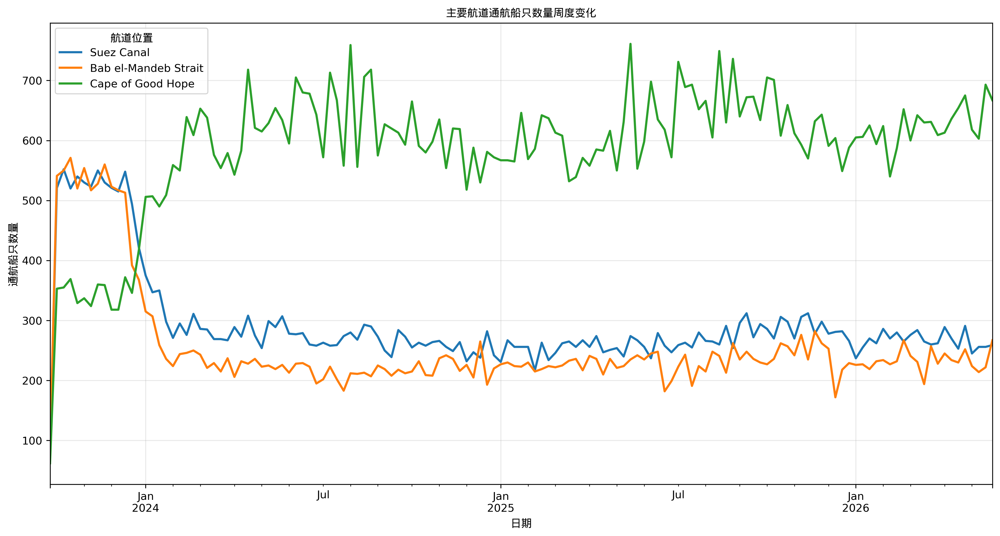
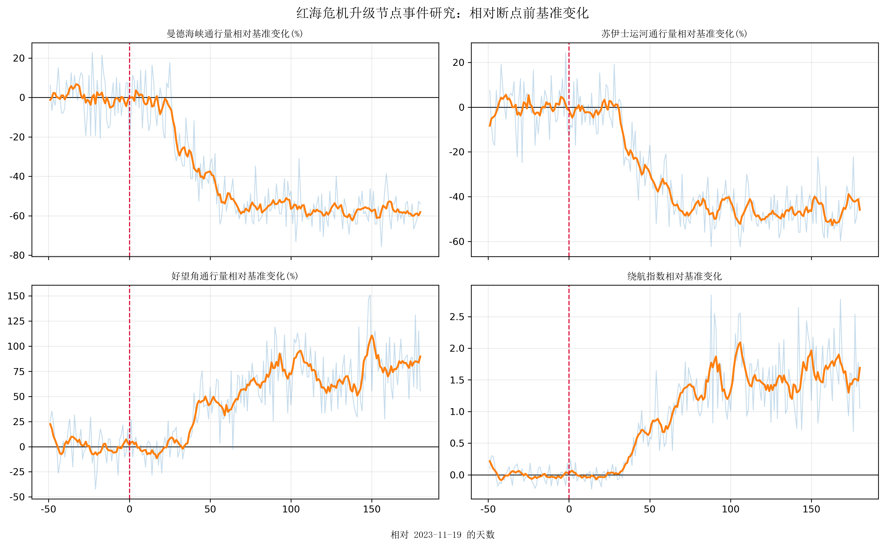
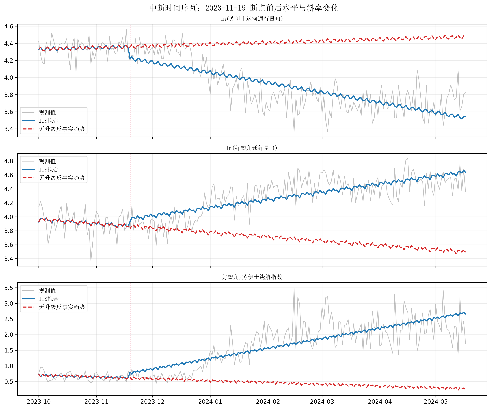
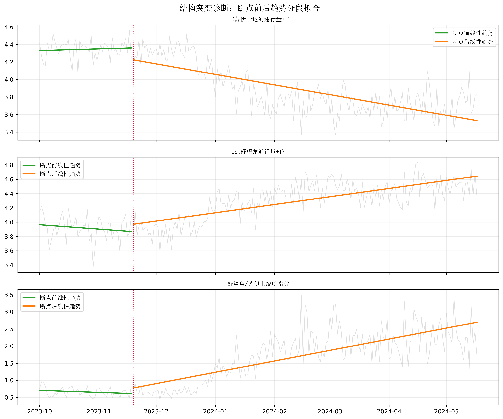

## 摘要

自 2023 年末以来，红海及亚丁湾安全局势恶化，对苏伊士运河、曼德海峡和好望角航线产生了持续影响。本文基于 ACLED 事件数据和 IMF PortWatch / PortStraitWatch 航道通行指标，研究胡塞武装相关安全事件与红海关键航道通行量、船舶绕航行为之间的统计关系。研究将 ACLED 中胡塞、红海、亚丁湾相关事件按日期聚合，并保留爆炸/远程暴力、战斗、针对平民暴力和战略发展等更接近安全冲击的事件类型；同时使用 PortWatch 中苏伊士运河、曼德海峡和好望角的日度通行数据，构造通行量、绕航指数和苏伊士通行占比。方法上，本文首先使用向量自回归模型和脉冲响应函数考察袭击事件、曼德海峡通行量和好望角通行量之间的动态关系；其次围绕 2023 年 11 月 19 日 Galaxy Leader 劫持事件构造事件研究、中断时间序列和 Chow 结构突变检验，并使用 Newey-West 稳健标准误修正日度时间序列中的异方差和自相关问题。结果显示，安全事件与航道通行结构之间存在一定动态关联，特别是断点后好望角通行量、好望角/苏伊士绕航指数显著上升，苏伊士和曼德海峡通行量显著下降。本文据此将结论限定在聚合航道层面的准实验式统计关联，不讨论当前数据无法验证的单船风险、AIS 开关影响或船型敏感性问题。本文的贡献在于将冲突事件数据与航运通行数据结合，为红海危机下航运路线调整提供一个可复现的统计分析框架。

**关键词**：红海危机；胡塞武装；航运绕航；PortWatch；ACLED；事件研究；中断时间序列；结构突变

## 1. 引言

红海至苏伊士运河航线是连接亚洲、欧洲和地中海地区的重要海上通道。与绕行非洲南端的好望角航线相比，经由曼德海峡、红海和苏伊士运河的路径通常距离更短、时间成本更低，因此长期承担着全球贸易中的大量集装箱、能源和大宗商品运输。然而，自 2023 年末以来，也门胡塞武装在红海、亚丁湾及周边海域的袭击事件显著增加，船舶安全风险上升，部分航运企业开始调整航线并绕行好望角。美国海事管理局的 Red Sea Hijacking 通告记录，Bahamian flagged M/V Galaxy Leader 于 2023 年 11 月 19 日在也门 Hodeida 以西约 50 海里处被劫持；PBS/AP 报道也在同日确认该船被胡塞武装扣押。本文因此把 2023 年 11 月 19 日作为红海商业船舶袭击升级的外生断点。UNCTAD 在 2024 年关于红海、黑海和巴拿马运河三类航运中断的快速评估中指出，红海航线中断已经影响全球贸易路线、运输成本和港口网络。IMF 也借助 PortWatch 平台指出，红海袭击对全球贸易和港口活动产生了可观扰动。

在这一背景下，一个自然的统计问题是：胡塞武装相关安全事件是否改变了红海关键航道的通行量，并推动船舶绕行好望角？如果存在影响，这种影响是立即发生，还是具有滞后性？这些问题既具有现实意义，也适合转化为数理统计课程中的时间序列建模问题。

本文围绕如下主问题展开：

```text
胡塞武装相关安全事件增加后，红海航线通行量和好望角绕航指标是否出现可识别的动态变化？
```

这一主问题进一步拆分为三个可由现有数据验证的子问题：

1. 胡塞相关安全事件增加后，曼德海峡通行量是否出现下降或动态调整？
2. 安全事件是否推动好望角通行量上升，从而反映绕航行为增加？
3. 2023 年 11 月 19 日红海危机升级节点后，苏伊士、曼德海峡、好望角和绕航指数是否出现结构性变化？

为避免三个问题在论证中相互混淆，本文将其分为三条相对独立但相互递进的分析线索。第一条线索关注安全事件本身是否具有持续性，这是后续讨论航运响应的前提；第二条线索关注安全事件是否通过滞后机制影响通行结构，重点观察曼德海峡和好望角之间的替代关系；第三条线索关注一个明确升级节点之后的断点变化，用于补充 VAR 模型难以单独承担的准实验识别。

| 分析线索 | 核心问题 | 理论含义 | 主要方法 | 结果位置 |
| --- | --- | --- | --- | --- |
| 问题一 | 安全事件是否具有持续性 | 风险信号是否会在时间上累积 | VAR 中 `attack_count` 方程 | 5.1 |
| 问题二 | 安全事件是否推动绕航 | 风险成本上升是否改变航道选择 | VAR、脉冲响应函数 | 5.1、5.2 |
| 问题三 | 升级节点后是否出现结构变化 | 外生冲击后航运结构是否偏离原趋势 | 事件研究、ITS、Chow 检验 | 5.3 |

据此，本文提出三条经验假设：

**H1：安全事件具有持续性。** 如果红海冲突活动不是孤立事件，则本周袭击事件数应当受到前几周袭击事件数的显著影响。

**H2：安全事件对航道通行结构的影响具有滞后性。** 由于航线调整涉及保险、燃油、船期和合同安排，袭击事件对好望角通行量的影响更可能出现在随后数周，而不是完全表现为同期效应。

**H3：2023 年 11 月 19 日升级节点后，航道结构出现断点式变化。** 如果 Galaxy Leader 劫持事件改变了航运企业对红海航线的风险预期，则断点后苏伊士和曼德海峡通行量应下降，好望角通行量与绕航指数应上升。

本文主动放弃当前数据不能验证的问题，包括单船遇袭概率、AIS 开关行为以及不同船型的风险敏感性。原因在于，当前项目缺少历史 AIS 单船轨迹数据、未遇袭船舶对照组、保险费率、船东和具体航线选择信息。ACLED 是事件级冲突数据，PortWatch 是聚合通行指标，两者无法直接识别具体船舶。因此，本文只研究聚合航道层面的通行结构变化。

## 2. 文献与现实背景

红海危机对航运网络的冲击已经受到国际组织和航运经济研究的关注。UNCTAD 的快速评估强调，红海、黑海和巴拿马运河等关键通道同时受到地缘政治和气候因素影响，使全球贸易路线面临更高不确定性。IMF 关于红海袭击的分析指出，航运通道中断不仅改变船舶路线，也会通过运输时长、保险成本和港口活动影响全球贸易。Notteboom、Haralambides 和 Cullinane 对红海危机的航运网络影响进行了讨论，指出危机会影响船舶运营、航线网络和海上供应链。

从数据角度看，ACLED 为政治暴力和冲突事件提供了事件级记录，包含日期、地点、参与者、事件类型、伤亡和说明文字等字段。ACLED Codebook 将事件类型区分为 Battles、Explosions/Remote violence、Violence against civilians、Protests、Riots 和 Strategic developments 等。对本文而言，Protests 和 Riots 虽然反映政治社会活动，但与海事安全冲击的直接关联较弱，因此主要模型保留 Battles、Explosions/Remote violence、Violence against civilians 和 Strategic developments 四类事件。

PortWatch / PortStraitWatch 则提供了基于船舶活动的港口和关键通道监测数据，可用于观察苏伊士运河、曼德海峡和好望角等 chokepoints 的日度通行情况。与传统贸易统计相比，这类高频通行指标更适合识别突发事件下航运活动的短期变化。

方法上，本文采用四类时间序列工具。第一类是向量自回归模型。VAR 模型不预设单一因果方向，而是把多个时间序列作为系统共同建模，适合描述袭击事件数、曼德海峡通行量和好望角通行量之间的动态关系。第二类是事件研究。它以 2023 年 11 月 19 日为时间零点，比较断点前基准期和断点后不同窗口的通行量变化。第三类是中断时间序列。它把外生升级节点看作准实验冲击，用分段回归估计断点后的水平变化和斜率变化。第四类是 Chow 结构突变检验。由于航运通行量具有明显时间序列特征，断点回归中的标准误使用 Newey-West / HAC 方法修正自相关和异方差。

### 2.1 理论机制：安全冲击、航运成本与绕航决策

本文的理论分析基于一个简单的航运路线选择框架。航运企业在选择是否经由红海和苏伊士运河时，并不只比较航程距离，还会比较综合期望成本。可将一条航线的总成本概括为：

$$
E(C_{r,t})=C^{fuel}_{r,t}+C^{time}_{r,t}+C^{ins}_{r,t}+C^{risk}_{r,t},
$$

其中，$r$ 表示航线选择，本文主要区分红海/苏伊士路径 $R$ 与好望角路径 $C$；$C^{fuel}_{r,t}$ 表示燃油和常规运营成本，$C^{time}_{r,t}$ 表示航程延长和船期占用带来的时间成本，$C^{ins}_{r,t}$ 表示保险费用，$C^{risk}_{r,t}$ 表示安全风险对应的预期损失。若将安全风险写成“遇袭概率乘以损失规模”的形式，则有：

$$
C^{risk}_{r,t}=p_{r,t}L_{r,t},
$$

其中 $p_{r,t}$ 是航线 $r$ 在时期 $t$ 的风险概率或风险感知强度，$L_{r,t}$ 是一旦发生袭击、扣押、延误或改港时的预期损失。当前项目没有单船层面的遇袭概率数据，因此本文不能直接估计 $p_{r,t}$，只能用 ACLED 聚合安全事件数作为风险压力的代理变量。

在正常情况下，红海至苏伊士运河航线距离较短，通常具有时间和燃油成本优势。好望角航线距离更长，意味着更高燃油消耗、更多航行天数和更大的船期占用。因此，若只考虑常规运营成本，船舶通常倾向于选择红海航线。

胡塞相关安全事件改变的是风险相关成本项。袭击事件增加会提高航运企业对遇袭、扣押、延误、保险上浮和改港安排的预期。即使实际遇袭概率难以直接观测，只要风险感知和保险成本上升，红海航线的期望总成本就可能超过绕行好望角的成本。此时，绕航虽然距离更长，却可能成为风险调整后的较优选择。

用不等式表示，航运企业选择绕行好望角的条件可以写为：

$$
E(C_{C,t}) < E(C_{R,t}).
$$

在正常状态下，好望角路径的燃油和时间成本通常更高，即 $C^{fuel}_{C,t}+C^{time}_{C,t}>C^{fuel}_{R,t}+C^{time}_{R,t}$。红海危机升级后，如果红海路径的保险费用和风险预期上升幅度足够大，即：

$$
\Delta C^{ins}_{R,t}+\Delta C^{risk}_{R,t}
>
\left(C^{fuel}_{C,t}+C^{time}_{C,t}\right)
-
\left(C^{fuel}_{R,t}+C^{time}_{R,t}\right),
$$

则好望角路径会从“距离更长的替代路线”变成风险调整后的较优路线。本文的统计模型正是检验这一推断链在聚合通行数据中是否出现：红海/苏伊士通行量下降，好望角通行量和绕航指数上升。

这一机制能够解释本文的两个关键建模选择。第一，影响应具有滞后性，因为航运企业从观察风险信号到调整航线需要时间。第二，好望角通行量可能比曼德海峡通行量更清楚地反映绕航决策，因为绕航是一种替代路径选择，而不是单一通道的机械减少。

基于上述成本框架，三个研究问题可以被理解为同一理论机制的三个层次。问题一考察风险信号 $A_t$ 是否具有时间持续性，如果 $A_t$ 本身没有持续性，那么航运企业可能只面对短暂噪声；问题二考察风险信号是否传导到航道通行量，即 $A_t$ 的变化是否与 $Q^{Bab}_t$ 和 $Q^{Cape}_t$ 的后续变化相关；问题三则考察当 2023 年 11 月 19 日这一外生升级节点发生后，航道结构是否整体偏离原有趋势。三者的逻辑顺序是“风险信号是否持续”到“风险是否影响选择”再到“外生节点后结构是否突变”。

### 2.2 本文能验证什么

本文的数据能够验证的是“聚合航运通行结构是否随安全事件变化”，而不是“某艘船是否因某个具体事件改变航线”。三类研究问题与数据验证能力的关系如下：

| 研究问题 | 对应变量 | 可验证程度 | 说明 |
| --- | --- | --- | --- |
| 安全事件是否具有持续性 | `attack_count` 及其滞后项 | 强 | ACLED 可直接提供事件周度序列 |
| 安全事件是否与绕航增加相关 | `cape_good_hope_n_total`、`rerouting_index_total` | 中等 | PortWatch 能观察聚合通行变化，但不能识别单船决策 |
| 曼德海峡通行量是否下降 | `bab_el_mandeb_n_total` | 中等 | 可观察总量变化，但受贸易需求、季节性和船队调度影响 |

### 2.3 断点识别逻辑

本文新增的因果识别部分采用“外生断点 + 高频结果变量”的准实验思路。2023 年 11 月 19 日 Galaxy Leader 劫持事件具有三个适合作为断点的特征：第一，事件日期清楚，便于构造事件时间；第二，事件对象是商业船舶，直接改变航运企业对红海航线风险的认知；第三，该事件发生在 PortWatch 日度样本内，能够观察断点前后通行指标的连续变化。

若红海危机升级确实影响航运路线选择，应当看到一条完整的推断链：先是断点后红海相关通道的通行量下降，其次是好望角替代航线通行量上升，再次是好望角/苏伊士绕航指数上升、苏伊士占比下降。事件研究用于描述这条曲线；中断时间序列用于检验断点后的水平和趋势变化；结构突变检验用于判断断点前后趋势关系是否整体改变。

这一推断链可以概括为：

$$
A_t \uparrow
\Rightarrow E(C_{R,t}) \uparrow
\Rightarrow Q^{Suez}_t,Q^{Bab}_t \downarrow
\Rightarrow Q^{Cape}_t \uparrow,\ RI_t \uparrow,
$$

其中 $A_t$ 表示安全事件强度，$Q^{Suez}_t$、$Q^{Bab}_t$ 和 $Q^{Cape}_t$ 分别表示苏伊士、曼德海峡和好望角通行量，$RI_t$ 表示绕航指数。由于中间机制中的保险费率、船东决策和单船航线选择无法直接观测，本文只检验链条两端的可观测统计关系。

## 3. 数据来源与变量构造

### 3.1 ACLED 胡塞/红海相关事件数据

本文使用项目中已经下载并筛选的 ACLED 数据：

```text
data/acled_data/red_sea_yemen_houthi_related_2023_plus_limit30000.csv
```

该文件包含 2023 年 1 月 1 日至 2025 年 5 月 28 日期间的 22,688 条胡塞、红海、亚丁湾及相关地区事件。筛选规则基于 actor、location、admin、notes 和 tags 等字段中的关键词，包括 Houthi、Houthis、Ansar Allah、Red Sea、Gulf of Aden、Bab el-Mandeb、al-Hudaydah、Sanaa、Marib 等。

原始关键词筛选数据的事件类型分布如下：

| 事件类型 | 事件数 |
| --- | ---: |
| Protests | 12,632 |
| Battles | 4,743 |
| Explosions/Remote violence | 2,611 |
| Strategic developments | 1,518 |
| Violence against civilians | 1,165 |
| Riots | 19 |

为使解释变量更接近安全冲击，本文在模型中保留以下四类事件：

```text
Explosions/Remote violence
Battles
Violence against civilians
Strategic developments
```

过滤后共有 10,037 条事件。随后将事件按日期聚合为日度袭击事件数 `attack_count`，再与 PortWatch 数据合并。

### 3.2 PortWatch 航道通行数据

本文使用项目中已下载的 PortWatch 分析表：

```text
data/portwatch/portwatch_red_sea_analysis.csv
```

该表覆盖 2023 年 10 月 1 日至 2026 年 5 月 24 日，共 967 个日度观测，包含三个关键通道：

| 通道 | 变量前缀 | 作用 |
| --- | --- | --- |
| Suez Canal | `suez` | 红海至欧洲航线的核心通道 |
| Bab el-Mandeb Strait | `bab_el_mandeb` | 红海南端关键 chokepoint |
| Cape of Good Hope | `cape_good_hope` | 绕航替代路径 |

主要因变量包括：

| 变量 | 含义 |
| --- | --- |
| `bab_el_mandeb_n_total` | 曼德海峡日通行船舶总数 |
| `suez_n_total` | 苏伊士运河日通行船舶总数 |
| `cape_good_hope_n_total` | 好望角日通行船舶总数 |
| `rerouting_index_total` | 好望角通行量与苏伊士通行量之比 |
| `suez_share_total` | 苏伊士在苏伊士和好望角合计通行量中的占比 |

其中两个比例变量由通行量构造而来：

$$
RI_t=\frac{Q^{Cape}_t}{Q^{Suez}_t},
$$

$$
SS_t=\frac{Q^{Suez}_t}{Q^{Suez}_t+Q^{Cape}_t}.
$$

这里 $RI_t$ 表示好望角/苏伊士绕航指数，数值越高说明相对于苏伊士路径，更多船舶通过好望角；$SS_t$ 表示苏伊士通行占比，数值越低说明苏伊士路径在两条主要替代路径中的相对重要性下降。二者分别从“替代航线扩张”和“原航线份额下降”两个角度对应问题二和问题三。

PortWatch 主要变量的描述性统计如下：

| 变量 | 均值 | 标准差 | 最小值 | 中位数 | 最大值 |
| --- | ---: | ---: | ---: | ---: | ---: |
| `bab_el_mandeb_n_total` | 36.635 | 13.827 | 12 | 33 | 95 |
| `suez_n_total` | 42.108 | 12.607 | 10 | 39 | 95 |
| `cape_good_hope_n_total` | 84.533 | 20.923 | 13 | 85 | 204 |
| `rerouting_index_total` | 2.193 | 0.805 | 0.432 | 2.213 | 7.400 |
| `suez_share_total` | 0.337 | 0.104 | 0.119 | 0.311 | 0.698 |

### 3.3 数据合并与周度聚合

由于日度航运数据存在较强随机波动，且航线调整通常需要一定决策和执行时间，本文将日度合并数据进一步聚合为周度数据。具体做法是：对袭击事件数和各类通行量求周度总和，对绕航比例类变量取周度均值。最终得到 139 周宏观联立时序数据。

周度聚合公式为：

$$
A_w=\sum_{t \in w} A_t,\quad
Q^j_w=\sum_{t \in w} Q^j_t,\quad
RI_w=\frac{1}{n_w}\sum_{t \in w} RI_t,
$$

其中 $w$ 表示周，$j \in \{Bab,Suez,Cape\}$ 表示航道，$n_w$ 为该周包含的日度观测数。这样处理的目的不是改变研究对象，而是降低日度随机波动，并让周度滞后项更接近航运企业观察风险、重新安排航线和实际通过通道之间的决策节奏。

已有图表可用于论文展示：





## 4. 研究方法

本文的方法设计按照三个研究问题分层展开，而不是把所有模型解释为同一个因果检验。问题一使用 VAR 系统中的安全事件方程，判断袭击事件是否存在自相关和持续性；问题二使用 VAR 中航道通行量方程和脉冲响应函数，观察安全事件冲击是否在随后数周传导到曼德海峡和好望角通行量；问题三围绕 2023 年 11 月 19 日单独建立事件研究、中断时间序列和 Chow 结构突变检验，用于判断断点后航运结构是否偏离原有趋势。

三类模型的对应关系如下：

| 研究问题 | 被解释对象 | 统计识别重点 | 模型工具 |
| --- | --- | --- | --- |
| 问题一：安全事件持续性 | $A_w$ | $A_{w-k}$ 是否显著解释 $A_w$ | VAR 安全事件方程 |
| 问题二：绕航滞后传导 | $Q^{Bab}_w$、$Q^{Cape}_w$ | 安全事件冲击后的动态响应 | VAR 航道方程、IRF |
| 问题三：断点结构变化 | $Q^{Suez}_t$、$Q^{Bab}_t$、$Q^{Cape}_t$、$RI_t$、$SS_t$ | 断点后的水平和趋势是否改变 | 事件研究、ITS、Chow |

### 4.1 向量自回归模型

为分析安全事件与航道通行量之间的动态关系，本文构造三变量 VAR 系统：

$$
X_w =
\begin{bmatrix}
A_w \\
Q^{Bab}_w \\
Q^{Cape}_w
\end{bmatrix},
$$

其中 $A_w$ 表示第 $w$ 周安全事件数量，$Q^{Bab}_w$ 表示第 $w$ 周曼德海峡通行船舶数，$Q^{Cape}_w$ 表示第 $w$ 周好望角通行船舶数。VAR($p$) 模型可写为：

$$
X_w=c+\Phi_1X_{w-1}+\Phi_2X_{w-2}+\cdots+\Phi_pX_{w-p}+u_w,
$$

其中 $c$ 为常数向量，$\Phi_k$ 为第 $k$ 阶滞后系数矩阵，$u_w$ 为残差向量。展开后，安全事件方程可写为：

$$
A_w=\alpha_0+\sum_{k=1}^{p}\alpha_{1k}A_{w-k}
+\sum_{k=1}^{p}\alpha_{2k}Q^{Bab}_{w-k}
+\sum_{k=1}^{p}\alpha_{3k}Q^{Cape}_{w-k}
+\varepsilon^A_w.
$$

该方程主要回答问题一：若 $\alpha_{1k}$ 显著为正，说明安全事件具有持续性。航道通行方程可写为：

$$
Q^j_w=\gamma^j_0+\sum_{k=1}^{p}\gamma^j_{1k}A_{w-k}
+\sum_{k=1}^{p}\gamma^j_{2k}Q^{Bab}_{w-k}
+\sum_{k=1}^{p}\gamma^j_{3k}Q^{Cape}_{w-k}
+\varepsilon^j_w,\quad j\in\{Bab,Cape\}.
$$

该方程主要回答问题二：若 $\gamma^j_{1k}$ 在若干滞后阶上显著，说明安全事件对航道通行量具有滞后关联。

本文使用 AIC 在最多 3 周滞后内选择模型阶数。AIC 定义为：

$$
AIC(p)=\ln|\hat{\Sigma}_u(p)|+\frac{2K^2p}{T},
$$

其中 $\hat{\Sigma}_u(p)$ 是 VAR($p$) 残差协方差矩阵，$K$ 是系统变量个数，$T$ 是样本期数。AIC 越小表示模型在拟合效果和参数复杂度之间的折中越好。

在估计 VAR 后，本文进一步计算正交化脉冲响应函数。将 VAR 写成移动平均表示：

$$
X_w=\mu+\sum_{h=0}^{\infty}\Psi_h u_{w-h}.
$$

若安全事件冲击为一个标准差，则第 $h$ 期响应为：

$$
IRF_j(h)=\frac{\partial X_{j,w+h}}{\partial u^A_w},
$$

其中 $j$ 表示被观察的变量。本文关注 $IRF_{Bab}(h)$ 和 $IRF_{Cape}(h)$，即安全事件冲击后未来 8 周内曼德海峡和好望角通行量的动态变化。

VAR 模型的优点是能够把“安全事件”和“航道通行量”作为相互关联的时间序列系统处理，避免在缺少完整控制变量时过早设定单向因果结构。其局限也很明确：标准 VAR 通常要求序列平稳，结果还会依赖变量选择、滞后阶数和冲击识别顺序。因此，本文把 VAR 解释为探索性的动态相关性和响应模式，而不是严格因果效应。

### 4.2 事件研究、中断时间序列与结构突变检验

为了围绕红海危机升级节点进行更细致识别，本文将 2023 年 11 月 19 日设为事件日 `t = 0`。事件研究部分使用断点前 49 天作为基准期，比较断点后 `0-30` 天、`31-90` 天和 `91-180` 天的平均变化。对通行量变量，本文使用 `ln(Y+1)` 后再转换为相对基准期的百分比变化；对绕航指数和苏伊士占比，则报告相对基准期的水平差。

设事件时间为 $\tau=t-T_0$，其中 $T_0$ 为 2023 年 11 月 19 日。断点前基准均值为：

$$
\bar{Y}_{pre}=\frac{1}{49}\sum_{\tau=-49}^{-1}Y_t.
$$

对通行量变量，本文先定义 $Z_t=\ln(Y_t+1)$，再计算断点后窗口 $g$ 相对基准期的百分比变化：

$$
\Delta_g=100\left[\exp\left(\bar{Z}_g-\bar{Z}_{pre}\right)-1\right].
$$

对绕航指数和苏伊士占比等比例变量，本文直接计算水平差：

$$
\Delta_g=\bar{Y}_g-\bar{Y}_{pre}.
$$

中断时间序列模型设定为：

$$
Y_t=\beta_0+\beta_1 time_t+\beta_2 post_t+\beta_3 time\_after_t
+\delta'W_t+\varepsilon_t,
$$

其中 $post_t$ 表示日期是否在 2023 年 11 月 19 日及之后，$time\_after_t$ 表示断点后的时间趋势，$W_t$ 为星期固定效应。$\beta_2$ 衡量断点后的即时水平变化，$\beta_3$ 衡量断点后的斜率变化。若 $\beta_3$ 显著为负，说明断点后结果变量下降速度加快；若 $\beta_3$ 显著为正，说明断点后上升趋势增强。

由于日度航运数据可能存在自相关，本文使用 Newey-West / HAC 标准误，并设置最大滞后为 14 天。HAC 协方差矩阵可写为：

$$
\widehat{V}_{HAC}=(X'X)^{-1}
\left(\sum_{\ell=-L}^{L} k\left(\frac{\ell}{L+1}\right)
\sum_{t=|\ell|+1}^{T} x_t\hat{\varepsilon}_t
\hat{\varepsilon}_{t-|\ell|}x_{t-|\ell|}'\right)
(X'X)^{-1},
$$

其中 $L=14$，$k(\cdot)$ 为 Bartlett 权重函数。该修正不会改变系数估计值，但会使显著性检验更适合存在异方差和自相关的日度时间序列。

结构突变部分使用 Chow 检验，比较断点前后 `Y_t ~ time + weekday_FE` 的系数是否可以视为同一组参数。如果 Chow 检验 p 值较低，说明断点前后趋势关系存在整体结构性差异。该检验不能单独证明因果关系，但可以为“断点后航运结构发生变化”提供辅助证据。

Chow 检验的原假设是断点前后参数相同：

$$
H_0:\theta_{pre}=\theta_{post}.
$$

检验统计量为：

$$
F=
\frac{(SSR_{pooled}-SSR_{pre}-SSR_{post})/k}
{(SSR_{pre}+SSR_{post})/(n_{pre}+n_{post}-2k)},
$$

其中 $SSR_{pooled}$ 为全样本模型残差平方和，$SSR_{pre}$ 和 $SSR_{post}$ 分别为断点前、断点后模型残差平方和，$k$ 是每个分段模型的参数个数。若 $F$ 值较大且 p 值较小，则拒绝“断点前后同一趋势关系”的原假设。

## 5. 实证结果

### 5.1 VAR 模型结果

VAR 模型使用 139 周数据，AIC 自动选择的最佳滞后阶数为 3 周。模型估计结果显示，袭击事件数具有较强的一阶自相关，一阶滞后 `L1.attack_count` 对当前袭击事件数显著为正，系数为 0.721，p 值小于 0.001。这说明安全事件本身存在持续性，即冲突活动往往不是完全孤立的单周冲击。

在曼德海峡通行量方程中，曼德海峡自身的一阶和二阶滞后项显著为正，说明通行量具有较强惯性。相比之下，袭击事件变量对曼德海峡通行量的直接影响并不稳定，多个滞后项均未在常规水平上显著。这一结果意味着曼德海峡通行变化可能受安全事件影响，但这种影响并不表现为简单的同期或单一滞后线性下降。

在好望角通行量方程中，袭击事件变量表现出更明显的动态关系。一阶滞后袭击事件系数为负且显著，二阶滞后袭击事件系数为正且显著，三阶滞后项接近显著。这种正负交替的结果提示，航线绕行可能存在调整期：短期内船舶调度尚未完全反映风险变化，随后绕行行为逐步增加。好望角自身三阶滞后项也显著为正，说明绕航通行量存在持续性。

核心 VAR 结果可概括如下：

| 方程 | 主要结果 | 解释 |
| --- | --- | --- |
| `attack_count` | 一阶滞后显著为正 | 安全事件具有持续性 |
| `bab_el_mandeb_n_total` | 自身滞后显著，袭击项不稳定 | 曼德海峡通行量存在惯性，直接冲击不明显 |
| `cape_good_hope_n_total` | 袭击滞后项显著，方向随滞后变化 | 好望角绕航可能存在滞后调整 |

因此，H1 得到较强支持：安全事件序列确实存在显著持续性。H2 得到部分支持：好望角通行量与袭击事件滞后项之间存在显著动态关系，但曼德海峡通行量对袭击变量的响应不稳定。因此，更稳妥的解释是“安全冲击与绕航路径变化有关”，而不是“袭击直接导致曼德海峡通行量显著下降”。

### 5.2 脉冲响应解释

脉冲响应函数用于观察“袭击事件增加一个标准差”后，未来数周内航道通行量如何变化。结合 VAR 结果，本文更关注方向和动态模式，而非把响应值解释为严格因果效应。

从经济含义上看，好望角通行量对袭击冲击的滞后响应较符合现实机制。航运企业在接收到安全风险信号后，需要重新评估保险、燃料、船期、港口排队和客户合同，航线调整并非立即完成。因此，若安全冲击推动绕航，影响更可能在之后数周逐渐显现。

曼德海峡通行量对袭击事件的直接响应较弱，也具有合理解释。第一，PortWatch 指标反映的是聚合通行量，其中包括不同类型船舶和不同目的地航线，部分船舶即使面临风险也可能继续通行。第二，曼德海峡通行量受到季节性、全球贸易周期和船队调度影响，不完全由安全事件决定。第三，ACLED 事件发生地与实际航运决策之间并非一一对应。

### 5.3 2023 年 11 月升级节点的事件研究与断点检验

为进一步识别红海危机升级节点的影响，本文围绕 2023 年 11 月 19 日构造事件研究、中断时间序列和结构突变检验。事件研究图显示，断点后最初 30 天变化较小，但在断点后 31-90 天和 91-180 天，航道结构开始出现明显分化：曼德海峡和苏伊士运河通行量持续低于断点前基准，好望角通行量和绕航指数显著高于基准。



相对断点前 49 天基准，断点后 31-90 天曼德海峡通行量下降约 48.3%，苏伊士运河通行量下降约 36.7%，好望角通行量上升约 42.5%，好望角/苏伊士绕航指数提高 0.917。断点后 91-180 天，这一变化进一步扩大：曼德海峡通行量下降约 57.6%，苏伊士运河通行量下降约 46.8%，好望角通行量上升约 74.4%，绕航指数提高 1.558，苏伊士占比下降 0.289。

中断时间序列进一步检验断点后的水平变化和趋势变化。在断点前 49 天至断点后 180 天的主窗口中，苏伊士、曼德海峡和好望角的即时水平变化并非全部显著，但断点后的斜率变化高度显著：曼德海峡 `time_after` 系数为 -0.0043，p = 0.0002；苏伊士运河为 -0.0045，p < 0.001；好望角为 0.0058，p < 0.001；绕航指数为 0.0126，p < 0.001；苏伊士占比为 -0.0025，p < 0.001。这说明危机升级并不一定在事件日当天造成一次性跳变，而是在之后数周至数月内逐步改变航运路线结构。



在断点前 49 天至样本结束的敏感性窗口中，断点后水平变化更明显：曼德海峡和苏伊士运河通行量显著下降，好望角通行量和绕航指数显著上升，苏伊士通行占比显著下降。这表明红海危机的影响并非短期噪声，而是在更长样本中形成了持续的航道结构变化。

Chow 结构突变检验也支持这一判断。以断点前后 `Y_t ~ time + weekday FE` 的系数是否相同为原假设，好望角通行量的 Chow 检验 p 值为 0.025，苏伊士通行占比的 p 值为 0.033，均显示断点前后存在结构性差异。曼德海峡和苏伊士运河通行量的 Chow 检验未达到常规显著水平，说明其变化更像是断点后逐渐调整，而不是简单的模型参数整体突变。



综合三类断点方法，H3 获得较强支持：2023 年 11 月 19 日之后，航运结构确实朝“红海/苏伊士路径下降、好望角替代路径上升”的方向变化。由于断点前 PortWatch 样本只有 49 天，本文仍将这一证据表述为准实验式的探索性因果识别，而不是最终的强因果估计。

## 6. 讨论

本文结果表明，红海安全事件与航运通行结构之间存在一定动态关联，但这种关联并不是简单的“袭击增加，同期通行量立即下降”。围绕 2023 年 11 月 19 日的事件研究和中断时间序列进一步说明，红海危机更像是通过风险预期和航线安排逐步改变航运结构，而不是只产生一次性跳变。

首先，航运绕航具有滞后性。船舶一旦进入航线，短期内无法像陆上运输那样快速改变路径。航运公司通常需要根据风险评估、保险费用、燃油成本、船期延误和客户合同综合决策。因此，好望角通行量对袭击事件出现滞后响应，比同期响应更符合现实。

其次，曼德海峡和苏伊士运河通行量不是单一安全变量的函数。即使风险上升，仍可能有军舰护航、保险覆盖、特定货物时效要求或能源运输刚性需求，使部分船舶继续通行。由此看，安全事件对通行量的影响可能通过航线结构、运输成本和船期安排间接体现，而不是直接反映为某一通道的线性下降。

再次，断点识别结果增强了本文的推断链。事件日之后，红海/苏伊士路径通行量下降，好望角通行量和绕航指数上升，且 ITS 显示断点后斜率变化显著。这一组证据比单纯相关回归更接近因果解释：外生安全事件先改变风险预期，航运企业随后调整路线，聚合通行数据最终表现为替代航线扩张。

## 7. 稳健性与局限

本文已经采取两项基本稳健处理。第一，排除 Protests 和 Riots，仅保留更贴近安全冲击的事件类型，以减少解释变量噪声。第二，将日度数据聚合为周度数据，以降低日度随机波动并允许航运决策存在滞后。

但本文仍存在明显局限。

第一，ACLED 关键词筛选存在误筛和漏筛风险。关键词命中的事件不一定全部直接影响海上航运，而部分相关事件也可能没有出现在所选字段或关键词中。

第二，PortWatch 数据是聚合通行指标，无法识别单船、船东、目的港或具体航线决策。因此，本文已经将单船风险、AIS 开关影响和船型敏感性排除在研究问题之外，只讨论聚合航道层面的通行结构变化。

第三，本文没有引入全球贸易需求、油价、保险费率、运价指数、港口拥堵和季节性贸易周期等控制变量。因此，结果应被视为初步统计证据，而不是完整因果识别。

第四，本文使用的 VAR、中断时间序列和结构突变检验都以线性设定为主。红海危机可能存在阈值效应，例如只有当袭击密度、风险感知或保险成本超过某一水平后，航运企业才会大规模绕航。线性模型可能无法完全捕捉这种非线性机制。

第五，本文 VAR 使用周度水平变量进行探索性建模，尚未系统进行单位根检验、协整检验或差分稳健性比较。若用于更严格的时间序列论文，应进一步检验序列平稳性，并比较水平 VAR、差分 VAR 或误差修正模型的结果。

第六，事件研究和中断时间序列依赖 2023 年 11 月 19 日作为断点。该断点有清楚现实依据，但 PortWatch 当前数据最早从 2023 年 10 月 1 日开始，断点前只有 49 天前置期。因此，本文断点分析可以增强因果识别力度，但仍不能完全排除同期全球贸易需求、保险市场和航运公司策略变化等混杂因素。

## 8. 结论

本文基于 ACLED 胡塞/红海相关事件数据和 PortWatch 关键航道通行指标，研究了红海安全事件与航运通行量、绕航行为之间的统计关系。结果显示，安全事件本身具有持续性，曼德海峡通行量主要受自身历史水平影响，而好望角通行量与袭击事件滞后项之间存在更明显的动态关系。进一步围绕 2023 年 11 月 19 日 Galaxy Leader 劫持事件进行事件研究、中断时间序列和结构突变检验后，本文发现断点后苏伊士和曼德海峡通行量显著下降，好望角通行量、好望角/苏伊士绕航指数显著上升，苏伊士通行占比显著下降。这说明红海安全冲击可能通过航线调整影响航运结构，尤其表现为绕行好望角的滞后响应。

由此，本文的主要结论应表述为：胡塞武装相关安全事件与红海航运通行结构变化存在聚合层面的统计关联，且围绕 2023 年 11 月 19 日断点的准实验分析支持“红海/苏伊士路径下降、好望角替代路径上升”的推断链。但当前证据仍不足以支持单船风险、AIS 开关影响或船型敏感性结论。

未来研究可从三个方向扩展。第一，在获得历史 AIS 单船轨迹和可靠对照组之后，另行研究船舶层面的航线选择和风险暴露，而不是在本文中混入当前无法验证的单船问题。第二，加入运价、保险费率和燃油价格等经济变量，分析安全冲击如何通过成本渠道影响航线选择。第三，加入更长的断点前样本或对照航线，形成差分中的差分或合成控制设计，从而进一步提高因果识别强度。

## 参考文献

ACLED. (n.d.). *ACLED Codebook*. https://acleddata.com/knowledge-base/codebook/

ACLED. (n.d.). *What types of events does ACLED code?* https://acleddata.com/faq/what-types-events-does-acled-code

Bernal, J. L., Cummins, S., & Gasparrini, A. (2017). Interrupted time series regression for the evaluation of public health interventions: a tutorial. *International Journal of Epidemiology, 46*(1), 348-355. https://pmc.ncbi.nlm.nih.gov/articles/PMC5407170/

International Monetary Fund. (2024). *Red Sea Attacks Disrupt Global Trade*. https://www.imf.org/en/blogs/articles/2024/03/07/red-sea-attacks-disrupt-global-trade

International Monetary Fund & University of Oxford. (2023). *IMF and University of Oxford Launch PortWatch Platform to Monitor and Simulate Trade Disruptions*. https://www.imf.org/en/news/articles/2023/11/13/pr23390-imf-university-of-oxford-launch-portwatch-platform-monitor-simulate-trade-disruptions

Maritime Administration. (2023). *2023-005A-Red Sea-Hijacking*. https://www.maritime.dot.gov/msci/2023-005a-red-sea-hijacking

Lütkepohl, H. (2005). *New Introduction to Multiple Time Series Analysis*. Springer.

Newey, W. K., & West, K. D. (1987). A simple, positive semi-definite, heteroskedasticity and autocorrelation consistent covariance matrix. *Econometrica, 55*(3), 703-708.

Notteboom, T., Haralambides, H., & Cullinane, K. (2024). The Red Sea Crisis: ramifications for vessel operations, shipping networks, and maritime supply chains. *Maritime Economics & Logistics, 26*, 1-20. https://doi.org/10.1057/s41278-024-00287-z

PBS NewsHour. (2023). *Yemen's Houthi rebels hijack Israeli-linked ship in the Red Sea, take crew hostage*. https://www.pbs.org/newshour/world/yemens-houthi-rebels-hijack-israeli-linked-ship-in-the-red-sea-take-crew-hostage

Sims, C. A. (1980). Macroeconomics and reality. *Econometrica, 48*(1), 1-48.

UN Trade and Development. (2024). *Navigating troubled waters: Impact to global trade of disruption of shipping routes in the Red Sea, Black Sea and Panama Canal*. https://unctad.org/publication/navigating-troubled-waters-impact-global-trade-disruption-shipping-routes-red-sea-black

U.S. Energy Information Administration. (2024). *Red Sea disruptions increase oil flows around Cape of Good Hope*. https://www.eia.gov/todayinenergy/detail.php?id=62263

## 附录：复现说明

本文实证结果基于项目根目录中的以下命令生成：

```bash
cd /mnt/e/python/prob
MPLBACKEND=Agg /home/kelvin2005/anaconda3/bin/conda run --no-capture-output -n Prob python -u scripts/run_analysis_real.py
```

主要输入文件：

```text
data/acled_data/red_sea_yemen_houthi_related_2023_plus_limit30000.csv
data/portwatch/portwatch_red_sea_analysis.csv
```

主要图表由以下命令生成：

```bash
cd /mnt/e/python/prob
/home/kelvin2005/anaconda3/bin/conda run --no-capture-output -n Prob python -u scripts/plot_time_series.py
```

断点因果识别补充分析由以下命令生成：

```bash
cd /mnt/e/python/prob
/home/kelvin2005/anaconda3/bin/conda run --no-capture-output -n Prob python -u scripts/run_red_sea_causal_break_analysis.py
```

输出文件：

```text
docs/analysis_results/red_sea_causal_break_results.md
plot/red_sea_event_study_2023_11_19.png
plot/red_sea_interrupted_time_series_2023_11_19.png
plot/red_sea_structural_break_2023_11_19.png
```
